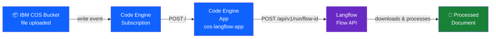
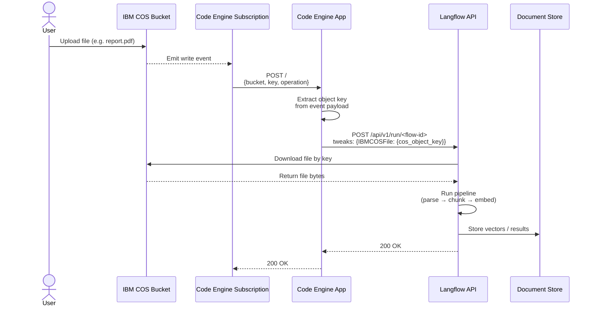

# COS → Langflow Auto-Trigger Setup

Automatically trigger a Langflow flow whenever a file is uploaded to an IBM Cloud Object Storage bucket.

## Architecture





---

## Prerequisites

Before running the setup script, make sure you have:

- **IBM Cloud account** with permissions to create Code Engine projects and Object Storage buckets
- **IBM Cloud CLI** installed — [install guide](https://cloud.ibm.com/docs/cli?topic=cli-install-ibmcloud-cli)
- **An existing COS bucket** with files you want to process
- **A running Langflow instance** with a flow that includes an IBM COS File component
- **Python 3** installed locally (used by the setup script for JSON parsing)

Log in to IBM Cloud before running setup:

```bash
ibmcloud login --sso
# or with API key:
ibmcloud login --apikey YOUR_API_KEY
```

---

## Quick Start

```bash
# 1. Copy the example environment file
cp .env.example .env

# 2. Edit .env with your actual values (see Configuration section below)
nano .env

# 3. Run the setup script
./setup.sh
```

To remove all created resources:

```bash
./teardown.sh
```

---

## Configuration

All configuration lives in a `.env` file. Copy the example and fill in each value:

```bash
cp .env.example .env
```

> **Security Note:** `.env` contains sensitive credentials and is excluded from git via `.gitignore`. Never commit it.

### Variable Reference

#### Langflow

| Variable | Required | Description |
|---|---|---|
| `LANGFLOW_URL` | Yes | Full URL of your Langflow flow's API endpoint |
| `LANGFLOW_API_KEY` | Yes | Langflow API key for authentication |
| `COS_COMPONENT_ID` | Yes | ID of the IBM COS File component in your flow |

**How to find `LANGFLOW_URL`:**
1. Open your flow in Langflow
2. Click the **API** button (top right)
3. Copy the endpoint — it looks like:
   ```
   https://your-langflow-host/api/v1/run/abc123?stream=false
   ```

**How to find `LANGFLOW_API_KEY`:**
1. In Langflow, go to **Settings → API Keys**
2. Create or copy an existing key

**How to find `COS_COMPONENT_ID`:**
1. In Langflow, click on your IBM COS File component
2. The component ID is shown in the component header (e.g. `IBMCOSFile`)
3. If you have multiple COS components, each has a unique ID like `IBMCOSFile-1`, `IBMCOSFile-2`

```bash
LANGFLOW_URL=https://your-langflow-host/api/v1/run/your-flow-id?stream=false
LANGFLOW_API_KEY=sk-your-api-key
COS_COMPONENT_ID=IBMCOSFile
```

---

#### IBM Cloud Object Storage

| Variable | Required | Description |
|---|---|---|
| `COS_BUCKET_NAME` | Yes | Name of your existing COS bucket |
| `COS_REGION` | Yes | Region where the bucket is located |

**How to find `COS_BUCKET_NAME`:**

```bash
ibmcloud cos buckets
```

**How to find `COS_REGION`:**

```bash
ibmcloud cos bucket-location-get --bucket YOUR_BUCKET_NAME
# Look for the "Region:" field in the output
```

Common region values: `us-south`, `us-east`, `eu-gb`, `eu-de`, `jp-tok`, `au-syd`

> **Important:** The Code Engine project is created in the same region as the bucket. This is required — IBM Code Engine COS subscriptions only work when both are in the same region.

```bash
COS_BUCKET_NAME=my-documents-bucket
COS_REGION=us-south
```

---

#### Code Engine

| Variable | Required | Description |
|---|---|---|
| `CE_PROJECT_NAME` | Yes | Name for the Code Engine project (created if it doesn't exist) |
| `CE_APP_NAME` | Yes | Name for the Code Engine app (created if it doesn't exist) |

These are just names — choose anything descriptive. If a project or app with that name already exists in `COS_REGION`, it will be reused.

```bash
CE_PROJECT_NAME=langflow-triggers
CE_APP_NAME=cos-langflow-app
```

---

## Running the Setup

```bash
./setup.sh
```

The script will:

1. **Install plugins** — installs the `code-engine` and `cloud-object-storage` IBM Cloud CLI plugins if not already installed
2. **Create Code Engine project** — creates a CE project in `COS_REGION` (or reuses an existing one)
3. **Deploy the app** — builds and deploys `app.py` + `main.py` as a Code Engine app that scales to zero when idle
4. **Create IAM authorization** — grants the CE project permission to configure COS bucket notifications
5. **Create COS subscription** — wires the COS bucket to the app so every file write triggers a POST

When complete, the output includes a summary:

```
==========================================
✓ Setup Complete!
==========================================

Configuration Summary:
  COS Bucket:    my-documents-bucket (region: us-south)
  CE Project:    langflow-triggers (2321b9ce-...)
  CE App:        cos-langflow-app
  App URL:       https://cos-langflow-app.xxx.us-south.codeengine.appdomain.cloud
  Subscription:  cos-langflow-app-cos-sub
```

---

## Testing

### 1. Upload a file to trigger the pipeline

```bash
ibmcloud cos object-put \
  --bucket YOUR_BUCKET_NAME \
  --key path/to/your-file.pdf \
  --body ./your-file.pdf \
  --region YOUR_REGION
```

### 2. Watch the app logs to confirm it was triggered

```bash
# Wake the app and follow logs in one command
APP_URL=$(ibmcloud ce app get --name cos-langflow-app | awk '/^URL:/{print $2}')
curl -s "$APP_URL" > /dev/null & ibmcloud ce app logs --name cos-langflow-app --follow
```

You should see output like:

```
2026-03-05T22:24:54 [INFO] Incoming request from 127.0.0.1
2026-03-05T22:24:54 [INFO] Detected Format 4: Code Engine COS subscription
2026-03-05T22:24:54 [INFO] object_key=path/to/your-file.pdf  bucket=my-documents-bucket
2026-03-05T22:24:54 [INFO] Calling Langflow  url=https://...  component=IBMCOSFile
2026-03-05T22:25:07 [INFO] Langflow responded  status=200
```

> **Note:** The app scales to zero when idle (`--min-scale 0`). If you run `--follow` without waking it first you will see "No running instances found". Either use the wake command above or see the [Logs](#logs) section to set up persistent logging.

### 3. Test the app directly (without uploading a file)

```bash
APP_URL=$(ibmcloud ce app get --name cos-langflow-app | awk '/^URL:/{print $2}')

curl -s -X POST "$APP_URL" \
  -H "Content-Type: application/json" \
  -d '{"bucket":"YOUR_BUCKET_NAME","key":"path/to/existing-file.pdf"}' \
  | python3 -m json.tool
```

A successful response looks like:

```json
{
    "status": "triggered",
    "object_key": "path/to/existing-file.pdf",
    "bucket": "my-documents-bucket",
    "langflow_status": 200,
    "langflow_response": "..."
}
```

---

## Logs

The app writes structured logs with timestamps and levels. To view them persistently — including past invocations after the app has scaled to zero — connect IBM Log Analysis to your Code Engine project.

### Step 1 — Create an IBM Log Analysis instance

1. Go to [cloud.ibm.com/catalog](https://cloud.ibm.com/catalog) and search for **Log Analysis**
2. Click **IBM Log Analysis**
3. Select:
   - **Region:** same as your `COS_REGION` (e.g. `us-south`)
   - **Plan:** `Lite` (free — 500 MB/day, 7-day retention)
   - **Name:** e.g. `langflow-logs`
4. Click **Create**

### Step 2 — Connect it to your Code Engine project

1. Go to [cloud.ibm.com/codeengine/projects](https://cloud.ibm.com/codeengine/projects)
2. Click your project (e.g. `langflow-triggers`)
3. In the left sidebar click **Integrations**
4. Under **Logging**, click **Add**
5. Select the `langflow-logs` instance and click **Select**

### Step 3 — Redeploy the app to pick up the logging config

```bash
ibmcloud ce app update --name cos-langflow-app --build-source .
```

### Step 4 — Open the dashboard

1. Go to [cloud.ibm.com/observe/logging](https://cloud.ibm.com/observe/logging)
2. Click **Open Dashboard** next to `langflow-logs`
3. Set the time range to **Last 15 minutes** (top right)
4. Search for `cos-langflow-app` to filter to your app

### Troubleshooting

| Symptom | Fix |
|---|---|
| No logs after upload | Set the dashboard time range to "Last 15 min" |
| Dashboard is empty | Ensure Log Analysis is in the same region as the CE project |
| Logs appear for startup but not requests | Redeploy after connecting logging (Step 3) |

---

## Teardown

```bash
./teardown.sh
```

This removes:
- The COS event subscription
- The Code Engine app
- Optionally the Code Engine project (you will be prompted)
- The IAM authorization policy

---

## Summary

| Step | What the script does |
|------|----------------------|
| 1 | Installs `code-engine` and `cloud-object-storage` CLI plugins |
| 2 | Creates (or selects) a Code Engine project in the bucket's region |
| 3 | Builds and deploys the trigger app from source |
| 4 | Creates IAM service-to-service authorization (CE → COS) |
| 5 | Creates a COS write-event subscription pointing to the app |
